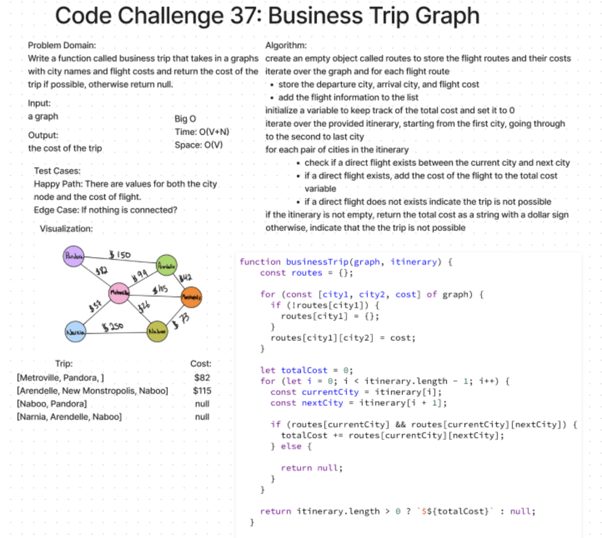

# [Code Challenge - 37](https://codefellows.github.io/common_curriculum/data_structures_and_algorithms/Code_401/class-37/)

## graph-business-trip

### Challenge Type: Code Challenge / Algorithm

#### Write a function called business trip

Arguments: graph, array of city names
Return: the cost of the trip (if it’s possible) or null (if not)
Determine whether the trip is possible with direct flights, and how much it would cost.

## Whiteboard Process

